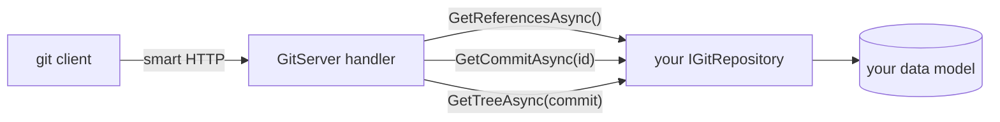

# How It Works

A git repository consists of **objects** (commits, trees and blobs) and **references** (branches and tags) pointing
to commits. A virtual repository does not store any of this. Instead, the server asks your implementation of
`IGitRepository` whenever a client needs something, and converts the answers into what git expects.



## References

`GetReferencesAsync()` returns the branches and tags of the repository, along with the branch `HEAD` points to
(which is the branch checked out after cloning):

```csharp
return new GitReferences().Head("main")
                          .Branch("main", latest.CommitId)
                          .Tag("v1", first.CommitId)
                          .Branch("drafts/login", draft.CommitId);
```

References can change at any time. A branch that moves forward results in a regular update for clients, a branch
that is replaced (e.g. a draft rebased onto a newer version) results in a forced update, which git handles
gracefully when fetching.

## Commits and why their ids must never change

A commit consists of the id of its file tree, the ids of its parent commits, an author, a committer (both with a
time stamp and a time zone) and a message. Its id is the SHA-1 hash of exactly these bytes.

This has an important consequence: if a single byte changes (a different time zone, a trailing line break in the
message, a parent that was computed differently), the commit gets a new id, and so do all commits built on top of
it. For clients, the whole history is rewritten.

!!! warning "Create commits once, then store them"
    Do not create commits on the fly from your data every time they are requested. Create the commit for a change
    once (when the change is saved), store `GitCommit.Data` (a few hundred bytes) along with your data, and restore
    the commit with `GitCommit.Parse(data)` whenever it is requested. This way, neither changes to your code nor
    updates of this library can change the history of a repository.

```csharp
// when a new version is saved
var commit = GitCommit.Create()
                      .Tree(await files.ComputeIdAsync())
                      .Parent(previous.CommitId)
                      .Author("Jane Doe", "jane@example.com", DateTimeOffset.UtcNow)
                      .Message("Add a login page")
                      .Build();

version.CommitId = commit.Id.ToString();   // indexed, to look up commits by id
version.CommitData = commit.Data.ToArray(); // the raw commit

// when the commit is requested
public ValueTask<GitCommit?> GetCommitAsync(GitObjectId id)
{
    var version = FindVersionByCommit(id.ToString());

    return new(version != null ? GitCommit.Parse(version.CommitData) : null);
}
```

Commits received with a push are handled the same way: the client already uses their ids, so they must be stored
exactly as received (see [Accepting Pushes](pushing.md)).

## Trees and files

`GetTreeAsync(commit)` returns the files of a commit as a `GitTree`, which is a flat list of files with their paths:

```csharp
return GitTree.Create()
              .Add("README.md", "# Hello")                        // text, stored as UTF-8
              .Add("assets/logo.png", pngBytes)                    // binary content
              .Add("run.sh", script, GitFileMode.Executable)        // executable file
              .Add("assets/large.bin", () => LoadAsync("large"))   // loaded on demand
              .Build();
```

Directories are derived from the paths, the order of the files does not matter. The server converts the files into
git tree and blob objects and verifies that the resulting tree id matches the tree id stored in the commit. If it
does not, the repository is inconsistent and the server refuses to serve it, as clients would reject the data anyway.

!!! note "Content must not change"
    The files of a commit must be returned with exactly the same content and modes every time. Do not normalize line
    endings, strip byte order marks or reformat content, as this changes the ids of the files.

The content of a file is only loaded if the server needs it, e.g. to send it to a client or to compute its id. Listing
the references of a repository (`git ls-remote`) does not read any files. If you know the blob id of a file (e.g.
because you stored `GitFile.Id` when it was pushed), pass it to the file and the server does not need to read the
content just to compute the id.

## How a fetch is answered

When a client fetches, it tells the server which commits it wants and which ones it already has. The server then:

1. Looks up the wanted commits and walks their history via `GetCommitAsync` until it reaches commits the client has.
2. Loads the files of the commits to be sent via `GetTreeAsync` and computes the git objects.
3. Leaves out files and directories the client already has with the commits the new ones are based on.
4. Streams a pack containing the remaining objects to the client.

A typical incremental fetch therefore only reads the files of the new commits and of the commit they are based on.

## Truncated histories

If your data model deletes old content (e.g. only the newest 50 versions are kept), the oldest remaining commit refers
to a parent that no longer exists. Return `null` from `GetCommitAsync` for such commits: the server treats the
repository as shallow and tells clients that the history ends there, exactly like a shallow clone created with
`git clone --depth`. Clients that already have older commits keep them: a client that says it has the parent of
the oldest remaining commit is told it has the history before it, so it goes on fetching newer commits as a
complete clone rather than being cut off as a shallow one (which git refuses).
