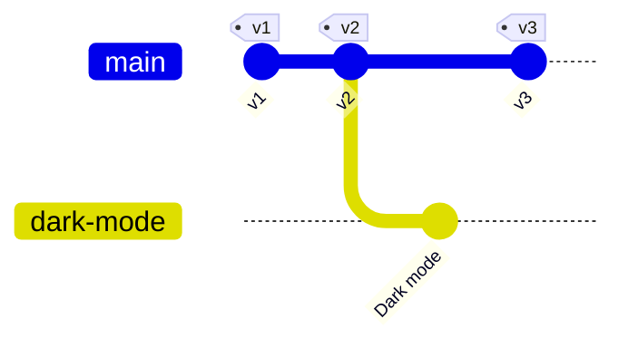

# Versioned Content

This example exposes a content store with **immutable versions** and **drafts** via git. It is modelled after
platforms such as [GenHTTP Lambda](https://genhttp.dev), where an app is saved as numbered versions and changes are
prepared in drafts (features) before they become a new version.

The complete, tested implementation can be found in
[`VersionedRepository.cs`](https://github.com/Kaliumhexacyanoferrat/virtual-git-server/blob/main/Testing/Fixtures/VersionedRepository.cs).

## The mapping

| Platform                                  | Git                                                                     |
|-------------------------------------------|-------------------------------------------------------------------------|
| Version 1, 2, 3, ...                      | Commits on `main`, each with the previous version as parent             |
| Every version                             | A tag `v1`, `v2`, `v3`, ...                                             |
| A draft based on version 2                | A branch with the name of the draft, based on the commit of version 2   |
| Saving a version in the editor            | A new commit on `main`                                                  |
| Pushing commits to `main`                 | One new version per commit                                              |
| Pushing a branch                          | Creates or updates the draft with that name                             |
| Deleting a branch                         | Deletes the draft                                                       |
| Merging a draft in the editor             | A new version (squash merge), the branch disappears                     |
| Deleting old versions                     | The history becomes shallow                                             |



## Storing commits

Every version stores the raw bytes of its commit along with its files. Versions created via the platform get a
commit created once when they are saved; versions created by a push keep the commit sent by the client:

```csharp
public sealed record StoredCommit(GitObjectId Id, byte[] Data, IReadOnlyDictionary<string, byte[]> Files);

public async Task<Version> SaveVersionAsync(IReadOnlyDictionary<string, byte[]> files, string note)
{
    var tree = ToTree(files);

    var builder = GitCommit.Create()
                           .Tree(await tree.ComputeIdAsync())
                           .Author("Platform", "noreply@example.com", DateTimeOffset.UtcNow)
                           .Message(note);

    if (Versions.Count > 0)
    {
        builder.Parent(Versions[^1].Commit.Id);
    }

    var commit = builder.Build();

    var version = new Version(Versions.Count + 1, new StoredCommit(commit.Id, commit.Data.ToArray(), files), note);

    Versions.Add(version);

    return version;
}
```

## Serving versions and drafts

```csharp
public ValueTask<GitReferences> GetReferencesAsync()
{
    var references = new GitReferences().Head("main");

    if (Versions.Count > 0)
    {
        references.Branch("main", Versions[^1].Commit.Id);
    }

    foreach (var version in Versions)
    {
        references.Tag($"v{version.Number}", version.Commit.Id);
    }

    foreach (var feature in Features.Values)
    {
        references.Branch(feature.Name, feature.Tip?.Id ?? GetVersion(feature.BaseVersion).Commit.Id);
    }

    return new(references);
}

public ValueTask<GitCommit?> GetCommitAsync(GitObjectId id)
{
    var stored = Find(id); // searches versions and drafts

    return new(stored != null ? GitCommit.Parse(stored.Data) : null);
}

public ValueTask<GitTree> GetTreeAsync(GitCommit commit) => new(ToTree(Find(commit.Id)!.Files));
```

A draft keeps the commits it consists of since its base version. When the draft is changed in the editor, a new
commit with the previous tip as parent is created, so clients receive a regular (fast-forward) update.

## Pushing to main

Versions never change, so only fast-forward updates without merge commits are accepted. Every pushed commit becomes a
version, in the order the commits were made:

```csharp
private async Task PushToMainAsync(GitPush push, GitReferenceUpdate update)
{
    if (update.IsDelete || !update.IsFastForward)
    {
        update.Reject("versions cannot be changed, pull and push again without --force");
        return;
    }

    if (update.Revisions.Any(r => r.Commit.Parents.Count > 1))
    {
        update.Reject("merge commits are not supported, please rebase");
        return;
    }

    lock (_lock)
    {
        // someone else might have saved a version in the meantime
        if (Versions[^1].Commit.Id != update.OldId)
        {
            update.Reject("a new version has been saved in the meantime, fetch first");
            return;
        }

        foreach (var revision in update.Revisions)
        {
            Versions.Add(new Version(Versions[^1].Number + 1, Store(revision), revision.Commit.Subject));
        }
    }

    await push.MessageAsync($"Created version {Versions[^1].Number}");

    update.Accept();
}
```

```text
$ git push
remote: Created version 3
To https://example.com/my-app
   8d0e4b2..3f2a1c9  main -> main
```

!!! tip "Many commits, many versions"
    If your platform keeps a limited number of versions, a push with many work-in-progress commits could push older
    versions out. Consider rejecting pushes with more than a few commits and asking the user to squash them, or
    offering a push option (`git push -o squash`) that turns the commits into a single version.

## Pushing drafts

A pushed branch becomes a draft. The server walks the first parents of the new commit until it reaches a version,
which becomes the base of the draft. Drafts may be rewritten (e.g. after rebasing onto a newer version), so forced
updates are accepted:

```sh
git checkout -b dark-mode v2
# ... change files ...
git commit -am "Dark mode"
git push -u origin dark-mode    # creates the draft "dark-mode" based on version 2

git rebase v3
git push --force                # moves the base of the draft to version 3

git push origin --delete dark-mode
```

## Retention

When older versions are deleted, `GetCommitAsync` no longer finds them and the oldest remaining version becomes the
shallow boundary of the repository. New clones are shallow, existing clones keep the history they already have, and
pushes continue to work.

## Things to decide early

- **What goes into commit messages**: everything in a commit is visible to everybody who can clone the repository
  and cannot be removed later without changing the history. Do not include internal notes.
- **Who is the author**: commits created by the platform need a stable identity, commits pushed by clients keep the
  identity configured in their git client.
- **What can be stored**: if the platform only supports regular files with certain names, reject everything else
  instead of silently dropping it, as the commit sent by the client must be served exactly as received.
